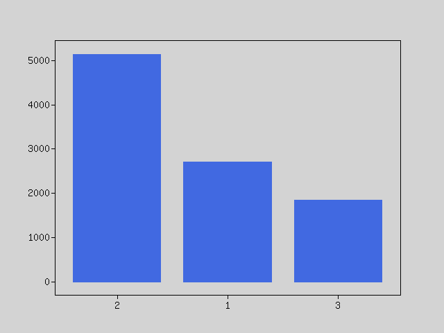
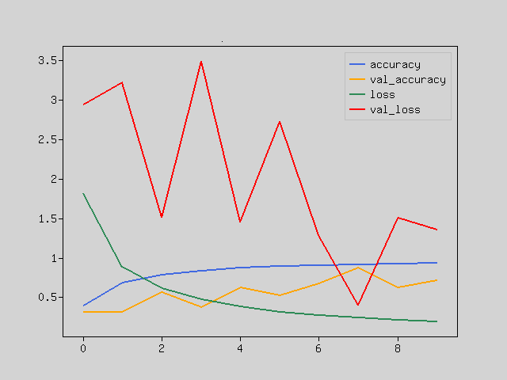
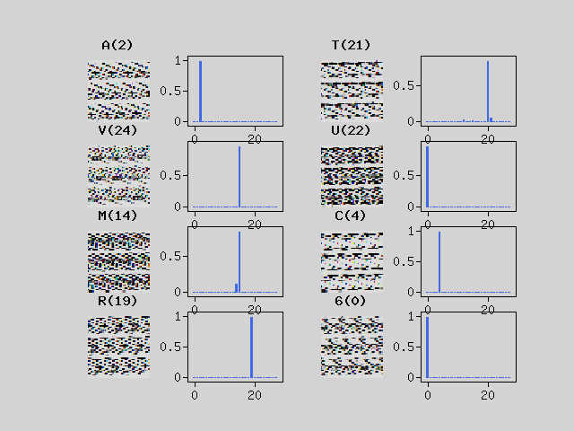

# Training Convolutional Neural Network in PHP

This project is about training convolutional neural network model (CNN) for use cases:
I self-driving vehicle
II captcha image recognition

## I self-driving vehicle
The goal for a trained model is to lead self-driving vehicle to choose proper action (go forward, turn left, turn right) based on image from front camera.
Car has to follow track inside created lane.

### Project base components

CNN model is based on Nvidia "DAVE 2" proposed architecture

https://arxiv.org/pdf/1604.07316v1.pdf

model implementation and training was handled thanks to Rindow Neural Networks

https://github.com/rindow/rindow-neuralnetworks

data distribution:

main program is based on chain of responsibility design pattern implemented using league/pipeline and containing stages:
1. Import data
2. Analyze dataset
3. Impute more data based on imported images
4. Split data to training and test set
5. Preprocess images - scale and flatten
6. Build convolutional neural network model from specified layers
7. Train model
8. Export model
9. Evaluate model

### Setup

To train and test model run:

`composer install`

inside dir /script run:

`php script/self-driving-car-image-classification-with-cnn-pipeline`

----------------------------------------------------------------------------------------

## II captcha image recognition

The goal for trained model is to recognize 6 characters from captcha images like below.

Captcha can contain any of 28 characters below. Letters are skewed, transformed and rotated.
['6', '2', 'A', 'B', 'C', 'D', 'E', 'F', 'G', 'H', 'I', 'J', 'K', 'L', 'M', 'N', 'O', 'P', 'Q', 'R', 'S', 'T', 'U', 'W', 'V', 'X', 'Y', 'Z']

data distribution:

### Pipeline
1. Import data
2. Analyze dataset
3. Crop and adjust image, extract single chars
4. Split data to training and test set
5. Preprocess images - scale and flatten
6. Build convolutional neural network model from specified layers
7. Train model
8. Export model
9. Evaluate model

### Results
Model trained with 42000 images and 20 epochs achieves 87% accuracy.

Prediction has good accuracy for all 28 classes.

 
### Setup

To train and test model run:

`composer install`

inside dir /script run:

`php captcha-image-classification-with-cnn-pipeline.php`